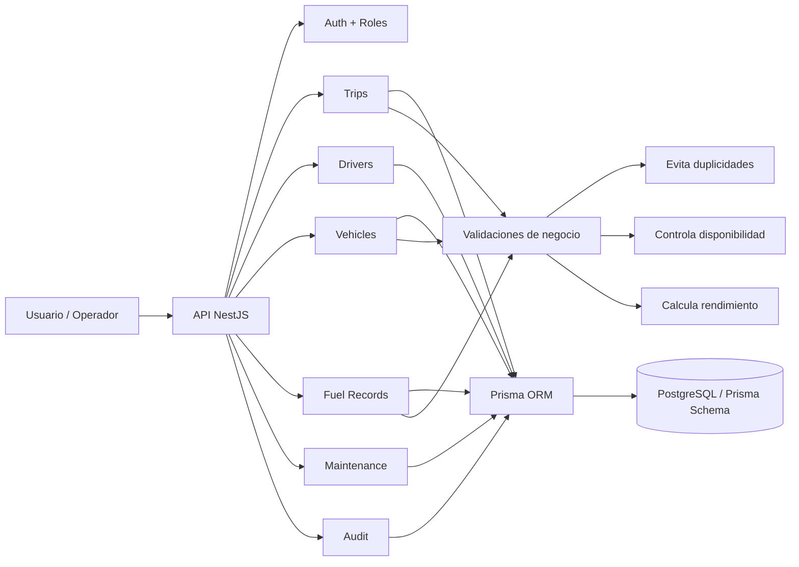
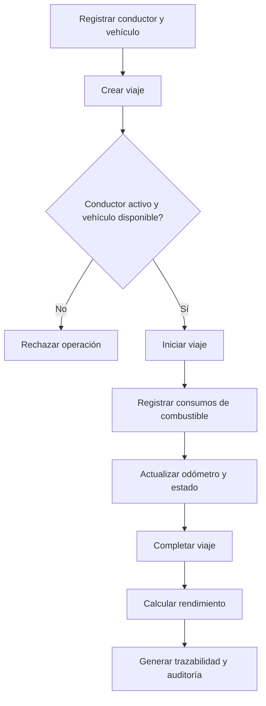
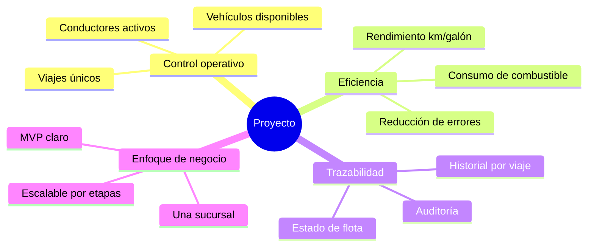
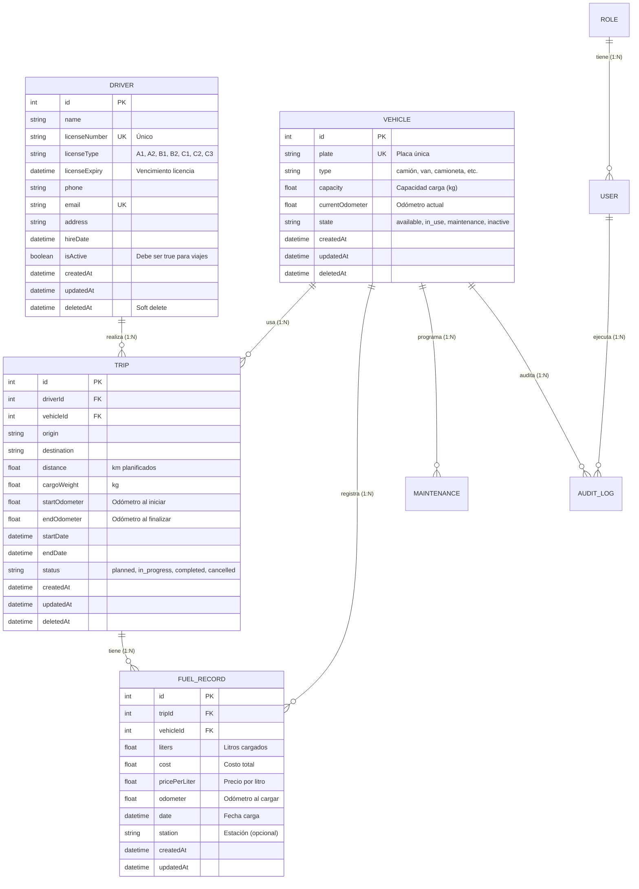
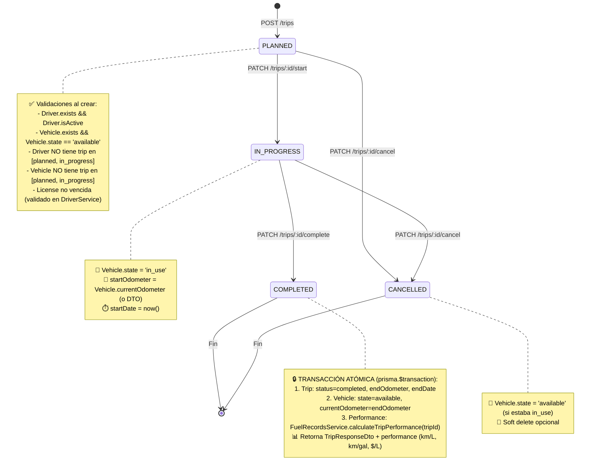
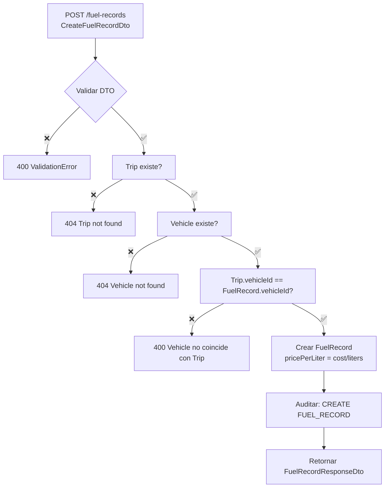

# Flujo Completo: Conductores ↔ Viajes ↔ Combustible

## Vista General del Proyecto



## Flujo Operativo del Negocio



## Diferenciador del Sistema



## Diagrama Entidad-Relación (Mermaid)



---

## Máquina de Estados del Viaje



---

## Flujo: Crear Viaje (POST /trips)

```mermaid
flowchart TD
    A[POST /trips<br/>CreateTripDto] --> B{Validar DTO<br/>class-validator}
    B -->|❌ Inválido| C[400 Bad Request<br/>ValidationError[]]
    B -->|✅ Válido| D[Buscar Driver por ID]
    D --> E{Driver existe?}
    E -->|❌| F[404 Not Found]
    E -->|✅| G{Driver.isActive == true?}
    G -->|❌| H[400 Driver inactivo]
    G -->|✅| I[Buscar Vehicle por ID]
    I --> J{Vehicle existe?}
    J -->|❌| K[404 Not Found]
    J -->|✅| L{Vehicle.state == 'available'?}
    L -->|❌| M[400 Vehicle no disponible<br/>estado: maintenance/in_use/inactive]
    L -->|✅| N[Verificar Driver sin viaje activo]
    N --> O{Driver libre?}
    O -->|❌| P[400 Driver tiene viaje activo<br/>IDs: planned/in_progress]
    O -->|✅| Q[Verificar Vehicle sin viaje activo]
    Q --> R{Vehicle libre?}
    R -->|❌| S[400 Vehicle tiene viaje activo]
    R -->|✅| T[Crear Trip<br/>status=planned<br/>startOdometer=Vehicle.currentOdometer]
    T --> U[Actualizar Vehicle<br/>state='in_use']
    U --> V[Auditar: CREATE TRIP]
    V --> W[Retornar TripResponseDto]
```

---

## Flujo: Completar Viaje (PATCH /trips/:id/complete)

```mermaid
flowchart TD
    A[PATCH /trips/:id/complete<br/>endOdometer, endDate?] --> B{Validar endOdometer >= startOdometer}
    B -->|❌| C[400 Odómetro final < inicial]
    B -->|✅| D[Trip existe y no deletedAt?]
    D -->|❌| E[404 Not Found]
    D -->|✅| F{Trip.status en [planned, in_progress]?}
    F -->|❌| G[400 Ya completed/cancelled]
    F -->|✅| H[INICIAR TRANSACCIÓN<br/>prisma.$transaction]
    H --> I[1. Actualizar Trip<br/>status=completed<br/>endOdometer, endDate]
    I --> J[2. Actualizar Vehicle<br/>state=available<br/>currentOdometer=endOdometer]
    J --> K[3. Calcular Performance<br/>FuelRecordsService.calculateTripPerformance(tripId)]
    K --> L{Hay FuelRecords?}
    L -->|Sí| M[Calcular: totalLiters, totalCost,<br/>distanceKm, kmPerLiter,<br/>kmPerGallon, avgPricePerLiter]
    L -->|No| N[performance = undefined]
    M --> O[COMMIT TRANSACCIÓN]
    N --> O
    O --> P[Auditar: COMPLETE TRIP]
    P --> Q[Retornar TripResponseDto<br/>+ performance?]
```

---

## Flujo: Registro de Combustible (POST /fuel-records)



---

## Cálculo de Rendimiento (FuelRecordsService)

```mermaid
flowchart TD
    A[calculateTripPerformance(tripId)] --> B[Buscar FuelRecords<br/>where: tripId]
    B --> C{Registros encontrados?}
    C -->|No| D[Lanzar NotFoundException<br/>'No fuel records for trip']
    C -->|Sí| E[Agregar: totalLiters = SUM(liters)]
    E --> F[Agregar: totalCost = SUM(cost)]
    F --> G[Obtener Trip.distance = distanceKm]
    G --> H[kmPerLiter = distanceKm / totalLiters]
    H --> I[kmPerGallon = kmPerLiter * 3.78541]
    I --> J[avgPricePerLiter = totalCost / totalLiters]
    J --> K[Retornar TripPerformanceDto]
```

---

## Reglas de Negocio Resumidas

| Regla | Implementación | Ubicación |
|-------|----------------|-----------|
| **Conductor único por viaje activo** | `findFirst driverId + status IN [planned, in_progress]` | `TripsService.create()` |
| **Vehículo único por viaje activo** | `findFirst vehicleId + status IN [planned, in_progress]` | `TripsService.create()` |
| **Vehículo debe estar disponible** | `vehicle.state === 'available'` | `TripsService.create()` |
| **Conductor debe estar activo** | `driver.isActive === true` | `TripsService.create()` |
| **Licencia no vencida** | Validación en `DriverService.activate()` | `DriversService` |
| **Odómetro final ≥ inicial** | `endOdometer >= trip.startOdometer` | `TripsService.completeTrip()` |
| **Transacción atómica al completar** | `prisma.$transaction([...])` | `TripsService.completeTrip()` |
| **Actualizar odómetro vehículo** | `vehicle.currentOdometer = endOdometer` | `TripsService.completeTrip()` |
| **Liberar vehículo al completar** | `vehicle.state = 'available'` | `TripsService.completeTrip()` |
| **Rendimiento km/galón** | `kmPerLiter * 3.78541` | `FuelRecordsService` |
| **Soft delete en todas las entidades** | `deletedAt DateTime?` + `where: { deletedAt: null }` | Prisma schema + Services |
| **Auditoría automática** | `AuditService.log(action, entity, id, data)` | Todos los Services |

---

## Endpoints Principales

### Conductores
```
POST   /drivers              # Crear
GET    /drivers              # Listar (query: includeInactive)
GET    /drivers/:id          # Obtener por ID
GET    /drivers/license/:num # Obtener por licencia
PATCH  /drivers/:id          # Actualizar
DELETE /drivers/:id          # Soft delete
PATCH  /drivers/:id/activate # Activar (valida licencia)
```

### Viajes
```
POST   /trips                    # Crear (valida driver + vehicle)
GET    /trips                    # Listar
GET    /trips/:id                # Obtener
PATCH  /trips/:id                # Actualizar (solo planned)
PATCH  /trips/:id/start          # Iniciar → in_progress
PATCH  /trips/:id/complete       # Completar → completed + transacción
PATCH  /trips/:id/cancel         # Cancelar → cancelled
DELETE /trips/:id                # Soft delete
```

### Combustible
```
POST   /fuel-records           # Registrar carga
GET    /fuel-records           # Listar (filtros: tripId, vehicleId, dateFrom, dateTo)
GET    /fuel-records/:id       # Obtener
GET    /fuel-records/trip/:tripId/performance  # Calcular rendimiento
PATCH  /fuel-records/:id       # Actualizar
DELETE /fuel-records/:id       # Soft delete
```

---

## Ejemplo de Respuesta: Completar Viaje con Rendimiento

```json
{
  "id": 1,
  "driverId": 1,
  "vehicleId": 1,
  "origin": "Bogotá",
  "destination": "Medellín",
  "distance": 415,
  "cargoWeight": 5000,
  "startOdometer": 125000,
  "endOdometer": 125415,
  "startDate": "2026-07-10T08:00:00.000Z",
  "endDate": "2026-07-10T14:30:00.000Z",
  "status": "completed",
  "driver": { "id": 1, "name": "Juan Pérez", "licenseNumber": "LIC123456" },
  "vehicle": { "id": 1, "plate": "ABC123", "type": "camión" },
  "performance": {
    "totalLiters": 50,
    "totalCost": 150000,
    "distanceKm": 415,
    "kmPerLiter": 8.3,
    "kmPerGallon": 31.4,
    "averagePricePerLiter": 3000
  },
  "createdAt": "2026-07-10T08:00:00.000Z",
  "updatedAt": "2026-07-10T14:30:00.000Z"
}
```