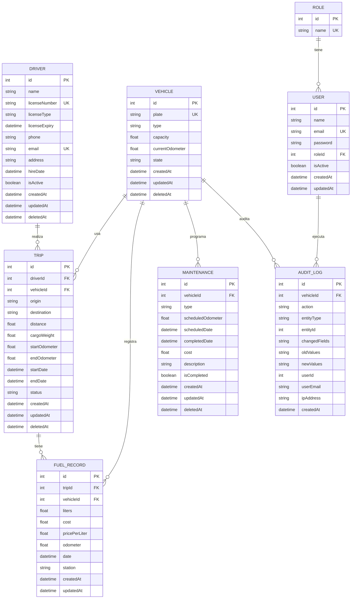
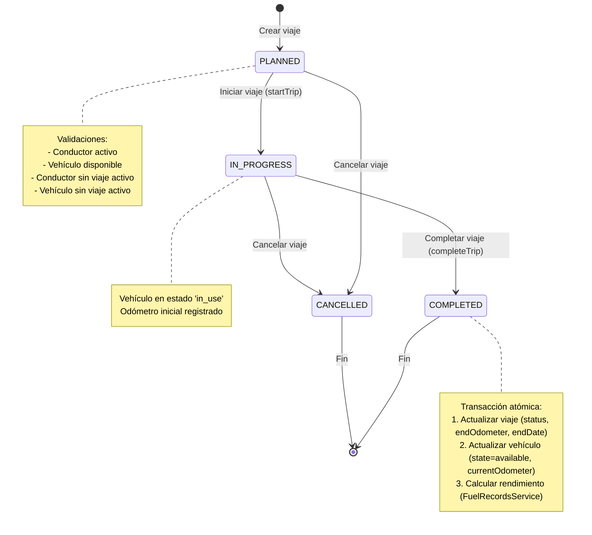
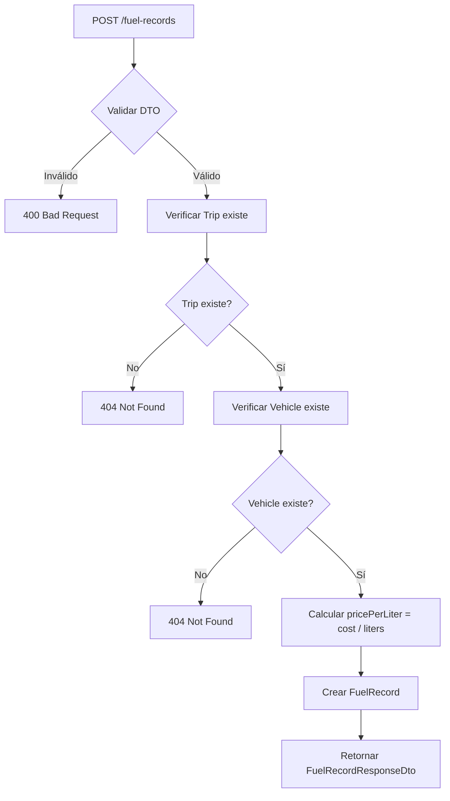

# Flujo de Modelos: Conductores, Viajes y Combustible

## Diagrama de Relaciones (Mermaid)



## Flujo de Estados del Viaje (State Machine)



## Flujo de Creación de Viaje

```mermaid
flowchart TD
    A[POST /trips] --> B{Validar DTO}
    B -->|Inválido| C[400 Bad Request]
    B -->|Válido| D[Buscar Conductor]
    D --> E{Conductor existe y activo?}
    E -->|No| F[404/400 Error]
    E -->|Sí| G[Buscar Vehículo]
    G --> H{Vehículo existe y disponible?}
    H --> I[state=available]?}
    H -->|No| I[404/400 Error]
    H -->|Sí| J[Verificar conductor sin viaje activo]
    J --> K{Conductor libre?}
    K -->|No| L[400 Conductor tiene viaje activo]
    K -->|Sí| M[Verificar vehículo sin viaje activo]
    M --> N{Vehículo libre?}
    N -->|No| O[400 Vehículo tiene viaje activo]
    N -->|Sí| P[Crear Trip status=planned]
    P --> Q[Actualizar Vehicle state=in_use]
    Q --> R[Retornar TripResponseDto]
```

## Flujo de Completar Viaje (con Transacción)

```mermaid
flowchart TD
    A[PATCH /trips/:id/complete] --> B{Validar endOdometer >= startOdometer}
    B -->|No| C[400 Bad Request]
    B -->|Sí| D[Iniciar Prisma Transaction]
    D --> E[Buscar Trip con driver y vehicle]
    E --> F{Trip existe y no completado/cancelado?}
    F -->|No| G[404/400 Error]
    F -->|Sí| H[Actualizar Trip: status=completed, endOdometer, endDate]
    H --> I[Actualizar Vehicle: state=available, currentOdometer=endOdometer]
    I --> J[Llamar FuelRecordsService.calculateTripPerformance(tripId)]
    J --> K{Existen FuelRecords?}
    K -->|Sí| L[Calcular: totalLiters, totalCost, distanceKm, kmPerLiter, kmPerGallon, avgPricePerLiter]
    K -->|No| M[performance = undefined]
    L --> N[Commit Transaction]
    M --> N
    N --> O[Retornar TripResponseDto con performance]
```

## Flujo de Registro de Combustible



## Cálculo de Rendimiento (km/galón)

```mermaid
flowchart LR
    A[FuelRecordsService.calculateTripPerformance(tripId)] --> B[Buscar FuelRecords por tripId]
    B --> C{Existen registros?}
    C -->|No| D[Lanzar NotFoundException]
    C -->|Sí| E[Agregar: totalLiters = SUM(liters)]
    E --> F[Agregar: totalCost = SUM(cost)]
    F --> G[Obtener Trip para distance]
    G --> H[distanceKm = trip.distance]
    H --> I[kmPerLiter = distanceKm / totalLiters]
    I --> J[kmPerGallon = kmPerLiter * 3.78541]
    J --> K[avgPricePerLiter = totalCost / totalLiters]
    K --> L[Retornar TripPerformanceDto]
```

## Reglas de Negocio Implementadas

| Regla | Implementación | Ubicación |
|-------|---------------|-----------|
| Conductor no puede tener 2 viajes activos | Validación en `TripsService.create()` | `src/trips/trips.service.ts:45-55` |
| Vehículo no disponible → bloquear viaje | Validación `vehicle.state !== 'available'` | `src/trips/trips.service.ts:57-62` |
| Actualizar odómetro al cerrar viaje | Transacción en `completeTrip()` | `src/trips/trips.service.ts:180-220` |
| Transacción BD al cerrar viaje | `prisma.$transaction([...])` | `src/trips/trips.service.ts:180` |
| Cálculo rendimiento km/galón | `FuelRecordsService.calculateTripPerformance()` | `src/fuel-records/fuel-records.service.ts` |
| Soft delete en todas las entidades | Campo `deletedAt` + filtro `deletedAt: null` | `prisma/schema.prisma` |
| Auditoría de cambios | `AuditService.log()` | `src/common/services/audit.service.ts` |

## Endpoints Principales

### Conductores
- `POST /drivers` - Crear conductor
- `GET /drivers` - Listar conductores
- `GET /drivers/:id` - Obtener conductor
- `PATCH /drivers/:id` - Actualizar conductor
- `DELETE /drivers/:id` - Eliminar (soft delete)
- `PATCH /drivers/:id/activate` - Activar conductor

### Viajes
- `POST /trips` - Crear viaje (valida conductor + vehículo)
- `GET /trips` - Listar viajes
- `GET /trips/:id` - Obtener viaje
- `PATCH /trips/:id` - Actualizar viaje
- `DELETE /trips/:id` - Eliminar (soft delete)
- `PATCH /trips/:id/start` - Iniciar viaje
- `PATCH /trips/:id/complete` - Completar viaje (transacción + rendimiento)
- `PATCH /trips/:id/cancel` - Cancelar viaje

### Combustible
- `POST /fuel-records` - Registrar consumo
- `GET /fuel-records` - Listar registros
- `GET /fuel-records/trip/:tripId` - Registros por viaje
- `GET /fuel-records/vehicle/:vehicleId` - Registros por vehículo
- `GET /fuel-records/performance/:tripId` - Calcular rendimiento
- `PATCH /fuel-records/:id` - Actualizar registro
- `DELETE /fuel-records/:id` - Eliminar registro
```

## Resumen de Integración

```
┌─────────────────┐     ┌─────────────────┐     ┌─────────────────┐
│   CONDUCTORES   │     │     VIAJES      │     │   COMBUSTIBLE   │
│                 │     │                 │     │                 │
│ - CRUD completo │────▶│ - CRUD completo │◀───│ - CRUD completo │
│ - Licencia única│     │ - Estados:      │     │ - Cálculo km/L  │
│ - Activo/Inactivo│    │   planned       │     │ - Cálculo km/gal│
│ - Auditoría     │     │   in_progress   │     │ - Precio prom.  │
└─────────────────┘     │   completed     │     └────────┬────────┘
                        │   cancelled     │              │
                        │ - Validaciones: │              │
                        │   * Conductor   │              │
                        │     libre       │              │
                        │   * Vehículo    │              │
                        │     disponible  │              │
                        │ - Transacción   │              │
                        │   al completar  │              │
                        └────────┬────────┘              │
                                 │                       │
                                 ▼                       │
                        ┌─────────────────┐              │
                        │    VEHÍCULOS    │──────────────┘
                        │                 │
                        │ - Estado:       │
                        │   available     │
                        │   in_use        │
                        │   maintenance   │
                        │ - Odómetro      │
                        │ - Auditoría     │
                        └─────────────────┘
```